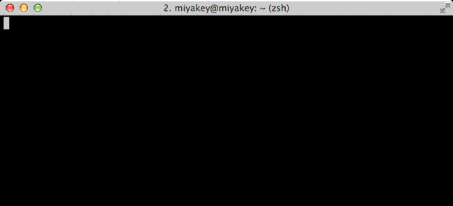
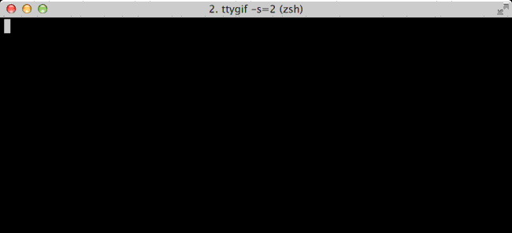

# vagrant-peco

A peco tool for vagrant-global-status.

## Description

### A peco tool

You can select vagrant global-status ID by peco, and the ID is passed to vagrant command.

### Fast boot  

vagrant-peco depends on [vagrant-global-status](https://github.com/monochromegane/vagrant-global-status) command.  
It is faster than native `vagrant global-status`.  

### Loading direnv file

If you use `direnv` on your vagrant path, vagrant-peco loads `.envrc` before executes vagrant command.

## Usage

```console
$ vagrant-peco <command>
```

You can specify same vagrant command (ex. status, up, halt...).

### vagrant-peco up



### vagrant-peco halt (select multiple)



## Installation

```console
$ cd $PATH
$ curl -O https://raw.githubusercontent.com/monochromegane/vagrant-peco/master/vagrant-peco
$ chmod +x ./vagrant-peco
```

### Note

`vagrant-peco` depends on the following.

- [peco](https://github.com/peco/peco)
- [Vagrant 1.6 or higher (vagrant global-status)](http://www.vagrantup.com/blog/feature-preview-vagrant-1-6-global-status.html)
- [vagrant-global-status](https://github.com/monochromegane/vagrant-global-status)

## Contributing

1. Fork it
2. Create your feature branch (`git checkout -b my-new-feature`)
3. Commit your changes (`git commit -am 'Add some feature'`)
4. Push to the branch (`git push origin my-new-feature`)
5. Create new Pull Request

